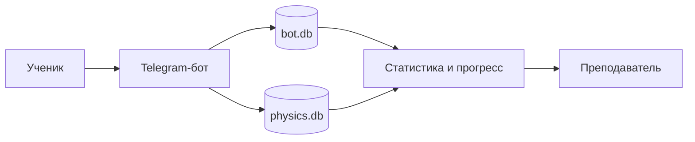
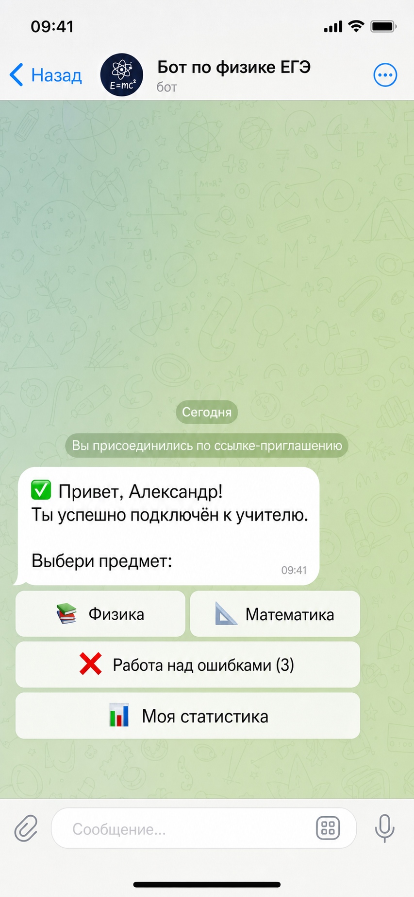
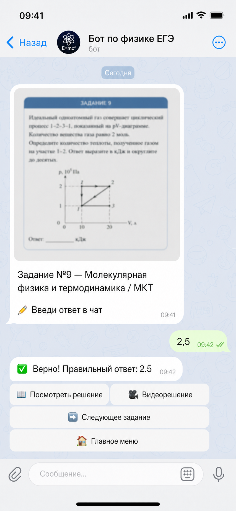
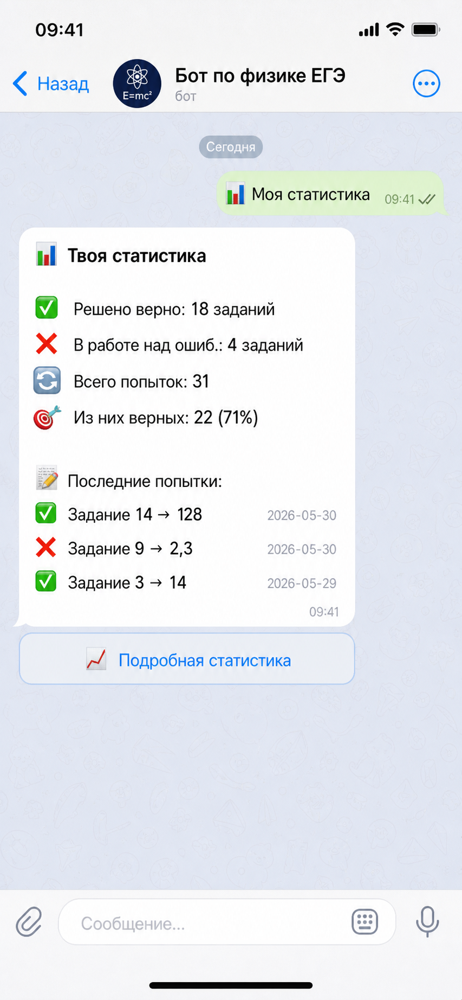

# Telegram-бот как рабочий сервис для репетиторов ЕГЭ и их учеников

Это рабочий сервис для репетиторов ЕГЭ по физике и математике и их учеников. Бот помогает ученику решать задания прямо в Telegram, а преподавателю управлять учебным процессом: подключать учеников, отслеживать прогресс, смотреть статистику и возвращать ученика к ошибкам.

Проект рассчитан на реальную связку "репетитор ↔ ученик": ученик получает задания, отправляет ответы, смотрит решения и возвращается к ошибкам, а репетитор подключает учеников по инвайт-ссылке и видит их статистику без отдельной админки.

## Что делает бот

- регистрирует учеников и учителей через Telegram-инвайты
- даёт механику нарешки заданий учеником прямо в Telegram
- позволяет выбирать задания по темам, номерам и типам задач
- принимает ответ на тестовые задания и сразу проверяет его автоматически
- сохраняет ошибки в отдельный список для повторной отработки
- позволяет отрабатывать неправильно решённые задачи отдельно
- показывает решения и видеорешения после задачи, если они добавлены в базу
- собирает статистику по попыткам, темам и номерам заданий
- даёт преподавателю быстрый доступ к статистике каждого ученика

Бот рассчитан на подготовку по **физике и математике**. В текущей версии основная учебная база и контент уже собраны вокруг физики, а сама логика проекта построена как тренажёр для регулярной нарешки заданий.

## Для кого проект

- для репетитора ЕГЭ, который ведёт учеников по физике и математике и хочет рабочий инструмент, а не таблицы и ручной учёт
- для ученика, которому удобнее решать задания, получать проверку и смотреть разбор прямо с телефона
- для формата регулярной индивидуальной подготовки, где важно видеть статистику, ошибки и динамику по темам

## Как это работает



Коротко по потоку:

1. Преподаватель создаёт инвайт-ссылку.
2. Ученик заходит в бота и привязывается к преподавателю.
3. Бот выдаёт задания из `physics.db` и `math.db`.
4. Результаты попыток, ошибки и связи пользователей сохраняются в `bot.db`.
5. На основе этих данных бот показывает статистику ученику и преподавателю.

## Скриншоты интерфейса

### Старт и главное меню



### Решение задания



### Статистика ученика



## Функции

### Для ученика

- вход по инвайт-ссылке преподавателя
- выбор предмета
- выбор заданий по темам, номерам и типам задач
- получение карточки задания
- автоматическая проверка тестовой части
- просмотр решения
- переход к видеорешению
- отдельная отработка неправильно решённых задач
- личная статистика

### Для преподавателя

- создание инвайта для ученика: `/invite`
- просмотр списка своих учеников: `/students`
- просмотр статистики по каждому ученику: `/stats`

### Для администратора

- создание инвайта для нового учителя: `/invite_teacher`
- просмотр списка учителей: `/teachers`
- снятие роли учителя

## База данных

В проекте используются несколько SQLite-баз.

Учебные базы данных и карточки заданий не входят в публичную версию репозитория. В Docker Compose они подключаются отдельно как локальные данные сервера.

### `database/bot.db`

Служебная база самого бота.

| Таблица | Что хранится |
| --- | --- |
| `users` | пользователи Telegram, их роль (`student`, `teacher`, `admin`), имя, username, привязка ученика к учителю |
| `invites` | инвайт-токены, кто их создал, для какой роли они предназначены, кто уже использовал ссылку |
| `progress` | состояние по каждому заданию: решено ли верно, сколько было попыток, когда обновлялось |
| `attempts` | история всех ответов ученика по заданиям |
| `mistakes` | список заданий, которые попали в работу над ошибками |

### `database/physics.db`

Контентная база с заданиями и решениями.

| Таблица | Что хранится |
| --- | --- |
| `questions` | тексты заданий, правильные ответы, тип задания, номер ЕГЭ, тема, `tg_file_id`, ссылка на видео |
| `solutions` | текстовые решения по `question_id` |
| `images` | связанные изображения для заданий |

В проекте используется база более чем на **5000 задач**, рассчитанная на нарешку, повторение и работу над ошибками.

В текущем состоянии этой версии проекта в базе:

- `questions`: 1124 записи
- `solutions`: 1124 записи
- `video_url`: 1019 видеорешений

### `database/math.db`

Отдельная SQLite-база под математику.

В математической базе:

- `questions`: 1324 записи
- `solutions`: 1324 записи
- `video_url`: 1004 видеорешений

## Структура проекта

```text
.
├── app/
│   ├── bot.py              # точка входа в приложение
│   ├── config.py           # загрузка .env и пути
│   ├── db.py               # работа с SQLite
│   ├── keyboards.py        # inline-клавиатуры
│   ├── states.py           # FSM-состояния
│   └── handlers/           # Telegram-хендлеры
├── database/               # bot.db, physics.db и math.db
├── cards/                  # PNG-карточки заданий
├── cards_solution/         # PNG-карточки решений
├── docs/
│   ├── screenshots/        # скриншоты для README
│   └── sources/            # PDF-материалы и спецификации
├── scripts/
│   ├── card_builder.py
│   ├── classify_questions.py
│   ├── fix_written_task_types.py
│   ├── migrate_video_links.py
│   └── pregenerate_cards.py
└── README.md
```

## Запуск через Docker Compose

### 1. Подготовить переменные окружения

```bash
cp .env.example .env
```

Заполни:

- `BOT_TOKEN` — токен Telegram-бота
- `ADMIN_IDS` — Telegram ID администраторов через запятую
- `BOT_DB_PATH_HOST` — путь на сервере к рабочей `bot.db`
- `PHYSICS_DB_PATH_HOST` — путь на сервере к приватной `physics.db`
- `MATH_DB_PATH_HOST` — путь на сервере к приватной `math.db`
- `CARDS_DIR_HOST` — путь на сервере к папке `cards`
- `CARDS_SOL_DIR_HOST` — путь на сервере к папке `cards_solution`

Пример:

```env
BOT_TOKEN=123456:ABCDEF
ADMIN_IDS=123456789,987654321
BOT_DB_PATH_HOST=/srv/ege-bot/private/database/bot.db
PHYSICS_DB_PATH_HOST=/srv/ege-bot/private/database/physics.db
MATH_DB_PATH_HOST=/srv/ege-bot/private/database/math.db
CARDS_DIR_HOST=/srv/ege-bot/private/cards
CARDS_SOL_DIR_HOST=/srv/ege-bot/private/cards_solution
```

### 2. Подготовить приватные данные на сервере

Для полноценного запуска нужны:

- приватная `physics.db`
- приватная `math.db`
- рабочая `bot.db`
- папка `cards/`
- папка `cards_solution/`

Эти данные не хранятся в публичном репозитории и не собираются внутрь Docker-образа. Они лежат в отдельной директории на сервере и подключаются к контейнеру через `volumes`.

`physics.db`, `math.db`, `cards/` и `cards_solution/` монтируются в контейнер только в режиме `read-only`.

### 3. Запустить контейнер

```bash
docker compose up --build -d
```

### 4. Посмотреть логи

```bash
docker compose logs -f bot
```

### 5. Остановить

```bash
docker compose down
```

## Переменные окружения

Файл `.env` читается из корня проекта.

| Переменная | Описание |
| --- | --- |
| `BOT_TOKEN` | токен Telegram-бота |
| `ADMIN_IDS` | список Telegram ID администраторов через запятую |

## Что я реализовал

- связку "учитель → инвайт → ученик" без ручной регистрации
- роли `student`, `teacher`, `admin` с разными сценариями работы
- механику нарешки заданий внутри Telegram
- выдачу заданий по темам, номерам и типам задач
- автоматическую проверку тестовой части
- хранение всех попыток и отдельный контур "работы над ошибками" для неправильно решённых задач
- статистику по попыткам, темам и номерам заданий
- просмотр статистики преподавателем по каждому ученику
- поддержку карточек заданий и карточек решений в виде PNG
- возможность посмотреть видеорешение после задачи
- кеширование `tg_file_id`, чтобы не грузить одинаковые изображения заново
- отдельные скрипты для классификации базы заданий, миграции видеоссылок и предгенерации карточек

## Стек и библиотеки

- Python 3
- `aiogram 3` — Telegram Bot API и маршрутизация хендлеров
- `sqlite3` — хранение пользователей, прогресса, заданий и решений
- `python-dotenv` — загрузка переменных окружения из `.env`
- `Pillow` — работа с изображениями карточек
- `matplotlib` — генерация графики для карточек заданий
- `pdf2image` — обработка PDF-материалов при подготовке контента
- `tqdm` — служебные прогресс-бары в скриптах подготовки базы
- Docker
- Docker Compose
